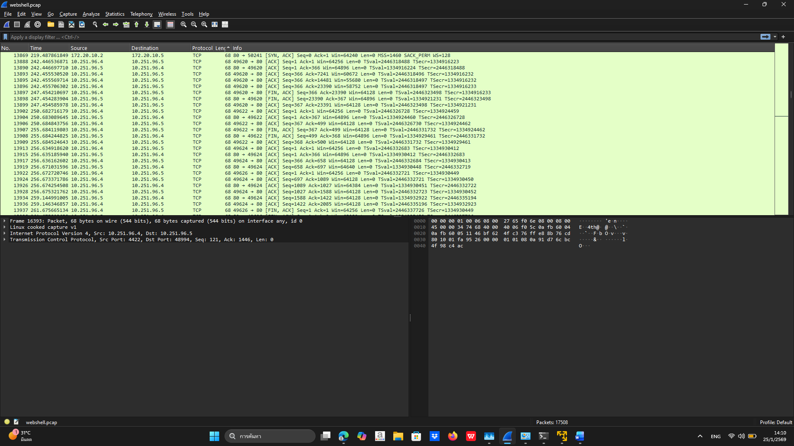
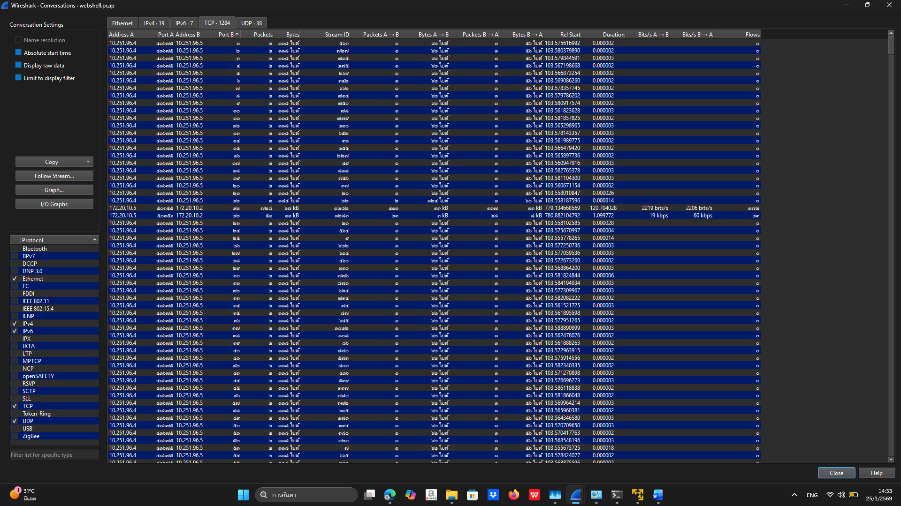
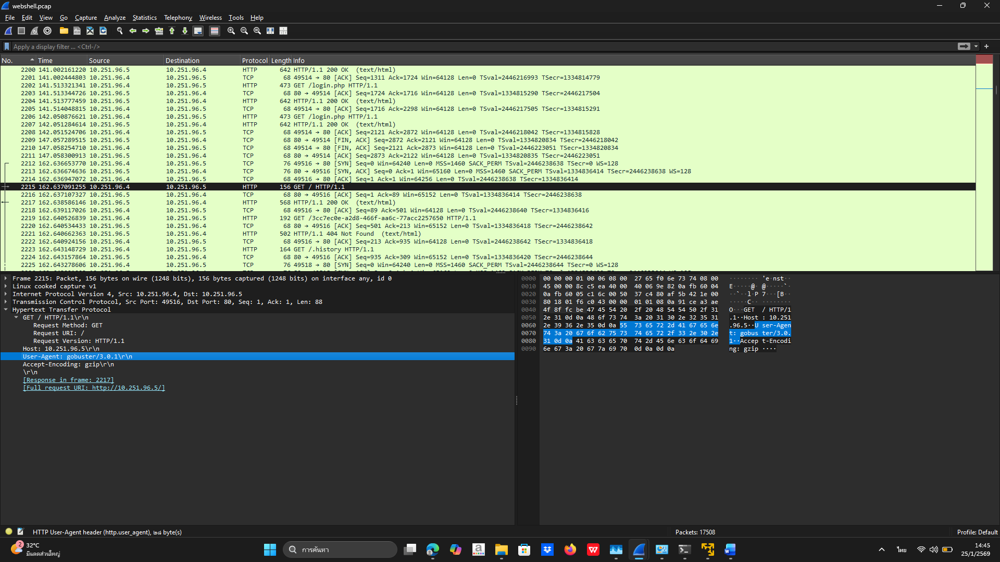
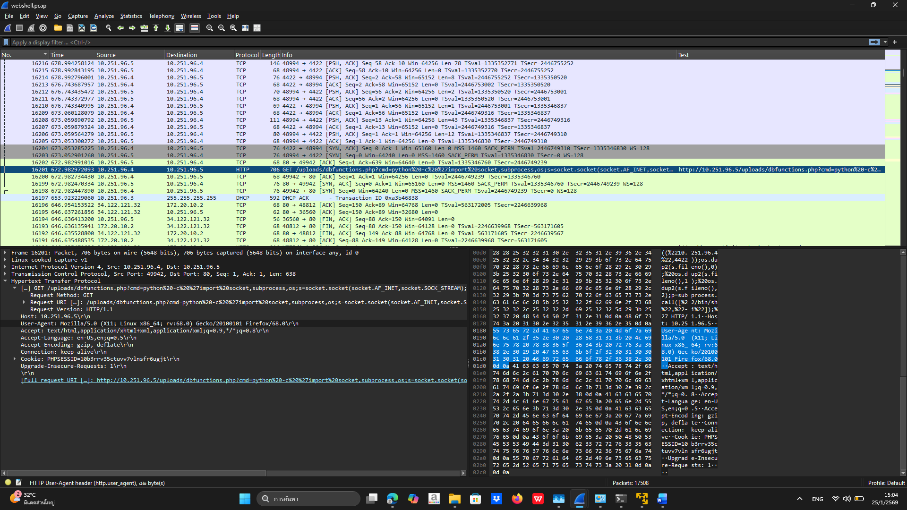

# Network Traffic Analysis Report

## 1. Overview
This analysis focuses on the inspection of network traffic captured in webshell.pcap
using Wireshark, aiming to identify suspicious behavior related to web-based attacks.

## 2. Suspicious Host Identification
A significant amount of traffic was observed between:
- 10.251.96.5 (Client)
- 10.251.96.4 (Server)

## 3. Port Scanning Activity
The client performed TCP SYN scans across ports 1–1024, indicating reconnaissance behavior.

## 4. Web Attack Indicators
Focused analysis on ports 80 and 443 revealed:
- Directory brute force via Gobuster
- Access to sensitive endpoints:
  - editprofile.php
  - upload.php
  - dbfunction.php

## 5. Tool Comparison Note
Wireshark was used for protocol-level inspection, while Microsoft Network Monitor
was considered for process-level correlation. However, the provided pcap file
was incompatible with Microsoft Network Monitor.

## 6. Conclusion
The traffic pattern suggests webshell-related activity involving directory brute forcing
and potential file upload exploitation.

