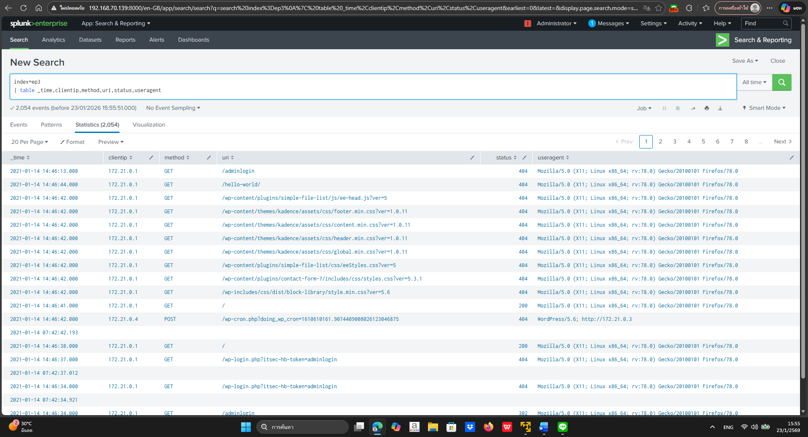
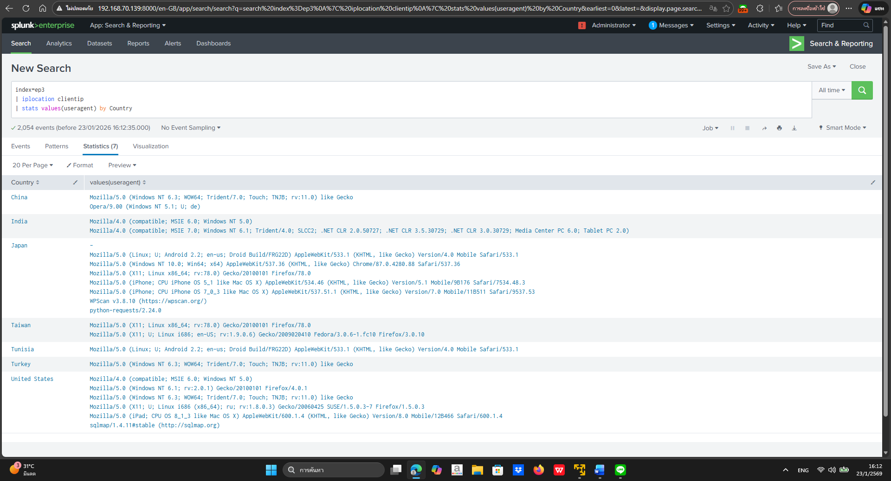

# บันทึกการสืบสวนทางนิติวิทยาศาสตร์ดิจิทัล (Forensics Investigation Log)
## กรณีศึกษา: WordPress ถูกโจมตีด้วย WPScan

---

## ข้อมูลคดี (Case Information)
- ประเภทคดี: Web Application Forensics
- แพลตฟอร์ม: WordPress
- แหล่งข้อมูล Log: Apache access.log
- เครื่องมือที่ใช้วิเคราะห์: Splunk
- ช่วงเวลาที่ทำการสืบสวน: 12:42:34 – 14:42:39
- ขอบเขตการสืบสวน (Scope): การโจมตีผ่านเครื่องมือ WPScan เท่านั้น

---

## 1. ภาพรวมเหตุการณ์ (Overview)
จากการตรวจสอบ access.log ของเว็บไซต์ WordPress พบพฤติกรรมการเข้าถึงที่ผิดปกติ
โดยเฉพาะการร้องขอ (HTTP Request) จาก IP ภายนอกที่มีรูปแบบซ้ำ ๆ และมีลักษณะเป็น
การใช้งานเครื่องมืออัตโนมัติ (Automated Tools) ซึ่งไม่สอดคล้องกับพฤติกรรมผู้ใช้งานทั่วไป

การสืบสวนครั้งนี้จึงมุ่งเน้นไปที่การตรวจสอบการโจมตีที่เกี่ยวข้องกับเครื่องมือ **WPScan**
ซึ่งเป็นเครื่องมือที่ใช้สำหรับค้นหาช่องโหว่ของ WordPress

---

## 2. การเตรียมข้อมูลและการคัดกรอง Log
ได้ทำการนำ access.log เข้าสู่ Splunk และตรวจสอบ field ที่สำคัญ ได้แก่
- เวลา (_time)
- IP Address
- HTTP Method
- URI
- Status Code
- User-Agent

จากนั้นได้ทำการกรองเฉพาะ IP ภายนอก (Public IP) เพื่อโฟกัสที่แหล่งที่มาของการโจมตี
โดย IP ภายใน (Private IP) ถูกตัดออกจากการวิเคราะห์

---

## 3. การวิเคราะห์แหล่งที่มาของการโจมตี (IP & Country Analysis)
ใช้คำสั่ง `iplocation` ใน Splunk เพื่อระบุประเทศต้นทางของ IP ที่เข้ามายังเว็บไซต์
พบว่ามีหลายประเทศที่มีพฤติกรรมการเข้าถึงผิดปกติ

IP บางรายการไม่สามารถระบุประเทศได้ ซึ่งสันนิษฐานว่าเป็น IP ภายใน หรือ IP ที่ถูกปกปิด
ผ่านเทคนิคเช่น Proxy หรือ VPN

---

## 4. การวิเคราะห์ User-Agent และการตรวจพบ WPScan
จากการตรวจสอบค่า User-Agent พบค่าที่มีความน่าสงสัยหลายรายการ
โดยเฉพาะ User-Agent ที่ระบุชัดเจนว่าเป็น **WPScan**

ตัวอย่าง User-Agent ที่พบ:
- `WPScan`
- `python-requests`

User-Agent เหล่านี้บ่งชี้ถึงการใช้งานเครื่องมืออัตโนมัติในการสำรวจช่องโหว่
ซึ่งแตกต่างจากพฤติกรรมของผู้ใช้งานเว็บไซต์ทั่วไปอย่างชัดเจน

---

## 5. การวิเคราะห์ลำดับเหตุการณ์ (Timeline Reconstruction)
จากการเรียงลำดับเหตุการณ์ตามเวลา พบลำดับการโจมตีดังนี้:

- **13:01:41** – ตรวจพบการใช้งาน WPScan เพื่อสำรวจเว็บไซต์ WordPress
- **13:26:53** – ตรวจพบการอัปโหลดไฟล์ `fr34k.php` ด้วย HTTP Status Code 200

ลำดับเหตุการณ์ดังกล่าวแสดงให้เห็นการพัฒนา (Progression) ของการโจมตี
จากขั้นตอนการสำรวจ (Enumeration) ไปสู่ขั้นตอนการโจมตีจริง (Exploitation)

---

## 6. การวิเคราะห์การอัปโหลดไฟล์และ Webshell
จากการตรวจสอบ URI และพฤติกรรมการอัปโหลดไฟล์ พบการอัปโหลดไฟล์
ที่มีลักษณะเป็น Webshell ชื่อ `fr34k.php`

เมื่อทำการสืบค้นข้อมูลเพิ่มเติม พบว่าเว็บไซต์มีการใช้งานปลั๊กอิน
**Simple File List เวอร์ชัน 4.2.2** ซึ่งมีช่องโหว่ประเภท Arbitrary File Upload
จึงมีความเป็นไปได้สูงว่าผู้โจมตีใช้ช่องโหว่นี้เป็นจุดเริ่มต้นของการโจมตี

---

## 7. การวิเคราะห์สาเหตุหลักของเหตุการณ์ (Root Cause Analysis)
จากหลักฐานทั้งหมด สามารถสรุปสาเหตุหลักของเหตุการณ์ได้ว่า:
- เว็บไซต์ใช้ WordPress plugin ที่มีช่องโหว่
- ไม่มีการอัปเดต plugin ให้เป็นเวอร์ชันล่าสุด
- ไม่มีมาตรการป้องกันการอัปโหลดไฟล์ที่ไม่ปลอดภัย

---

## 8. ผลกระทบที่อาจเกิดขึ้น (Impact Assessment)
- ผู้โจมตีสามารถอัปโหลดไฟล์ Webshell ได้สำเร็จ
- มีความเสี่ยงต่อการถูกควบคุมเว็บไซต์จากระยะไกล
- อาจนำไปสู่การโจมตีขั้นต่อไป เช่น Data Exfiltration หรือ Lateral Movement

---

## 9. ข้อเสนอแนะและแนวทางป้องกัน (Recommendations)
- เปิดใช้งาน Auto Update สำหรับ WordPress และ Plugin
- ลบ Plugin ที่ไม่จำเป็นหรือไม่มีการดูแล
- ใช้ Web Application Firewall (WAF)
- จำกัดการเข้าถึงหน้า Plugin Upload
- ติดตั้ง Security Plugin สำหรับ WordPress
- ทำ Hardening ก่อนนำระบบขึ้นใช้งานจริง (Production)

---

