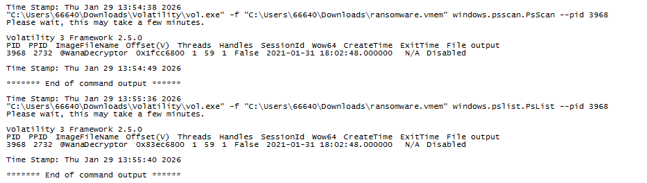
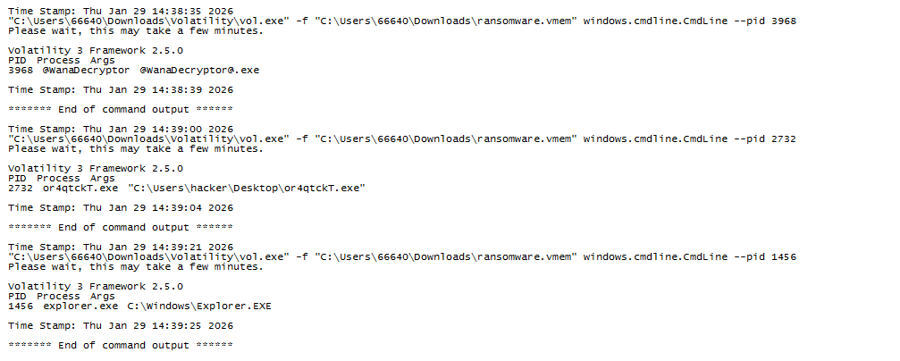
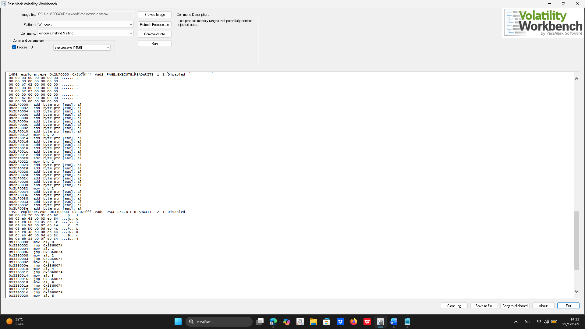

# Memory Forensics – Ransomware Investigation

โฟลเดอร์นี้เป็นส่วนหนึ่งของการสืบสวนเหตุการณ์ด้าน Digital Forensics  
โดยมุ่งเน้นการวิเคราะห์หน่วยความจำ (Memory Forensics)  
เพื่อระบุสาเหตุ (Root Cause) ของเหตุการณ์ที่เกี่ยวข้องกับ Ransomware

การวิเคราะห์ดำเนินการโดยใช้ Volatility Framework (Version 3)
กับไฟล์หน่วยความจำที่ได้จากเครื่องต้องสงสัย (`ransomware.vmem`)

---

## 🔍 ขอบเขตการสืบสวน (Scope)

- วิเคราะห์ process ที่เกี่ยวข้องกับเหตุการณ์
- ระบุจุดเริ่มต้นของการ execute โปรแกรมอันตราย
- ตรวจสอบพฤติกรรมต้องสงสัยในหน่วยความจำ (Code Injection)
- ไม่ครอบคลุมการวิเคราะห์ network หรือ persistence ในระดับ registry

---

## 🛠️ เครื่องมือที่ใช้ (Tools)

- Volatility Framework v3
- Memory Image: `ransomware.vmem`

---

## 🧠 Process ที่เกี่ยวข้อง (Key Processes)

| PID  | Process Name       | รายละเอียด |
|-----:|--------------------|------------|
| 2732 | or4qtckT.exe       | โปรแกรมต้องสงสัยที่ถูก execute จาก Desktop |
| 3968 | wanDecrypter.exe   | Ransomware payload |
| 1456 | explorer.exe       | Process ระบบที่พบพฤติกรรม code injection |

---

## 📁 ไฟล์ผลลัพธ์การวิเคราะห์ (Artifacts)

| ไฟล์ | รายละเอียด |
|-----|------------|
| pslist.txt | รายชื่อ process ที่ Windows kernel มองว่ายังทำงานอยู่ |
| psscan.txt | ร่องรอย process ที่พบจากการ scan หน่วยความจำ |
| cmdline.txt | คำสั่งที่ใช้เรียก process ต่าง ๆ |
| malfind.txt | ผลการตรวจสอบ memory region ที่อาจมี code injection |

> หมายเหตุ:  
> Output จริงของแต่ละคำสั่งถูกเก็บในรูปแบบ screenshot  
> เพื่อคงสภาพความถูกต้องของหลักฐาน (Evidence Integrity)

---

## 📸 หลักฐานจากการวิเคราะห์ (Screenshots)

### 1️⃣ การตรวจสอบ Process (pslist & psscan)

ภาพด้านล่างแสดงผลการเปรียบเทียบ process ที่ระบบมองว่า active
และ process artifacts ที่พบจากการ scan หน่วยความจำ

---

### 2️⃣ การตรวจสอบคำสั่งที่ใช้ Execute (cmdline)

จากผล cmdline พบว่าไฟล์ `or4qtckT.exe`
ถูกเรียกใช้งานโดยตรงจาก Desktop ของผู้ใช้งาน
ซึ่งบ่งชี้ถึงการ execute ผ่าน interactive session

---

### 3️⃣ การตรวจสอบ Code Injection (malfind)

จากการใช้คำสั่ง `malfind` พบ memory region
ที่มีสิทธิ์ `PAGE_EXECUTE_READWRITE`
ภายใน process `explorer.exe`
ซึ่งอาจบ่งชี้ถึงพฤติกรรม code injection

---

## 🧩 สรุปผลการสืบสวน (Summary)

- พบการ execute โปรแกรมต้องสงสัย (`or4qtckT.exe`) จาก Desktop
- โปรแกรม `wanDecrypter.exe` ทำหน้าที่เป็น ransomware payload
- ไม่พบการฝังโค้ดใน process ของ ransomware โดยตรง
- พบพฤติกรรมต้องสงสัยในหน่วยความจำของ `explorer.exe`
  ซึ่งสอดคล้องกับเทคนิคการฝังโค้ดเพื่อหลบการตรวจจับ

---

## 🎯 Root Cause

สาเหตุหลักของเหตุการณ์นี้คือ  
**การ execute โปรแกรมอันตรายโดยผู้ใช้งาน (User-Executed Malware)**  
ซึ่งนำไปสู่การทำงานของ ransomware
และพฤติกรรม code injection ใน process ระบบ

---

## 📌 หมายเหตุเพิ่มเติม

- การสืบสวนในโฟลเดอร์นี้เป็นคนละกรณีกับ
  การวิเคราะห์ WordPress / WPScan
- มีการแยกหลักฐานและรายงานตามแต่ละ case อย่างชัดเจน
