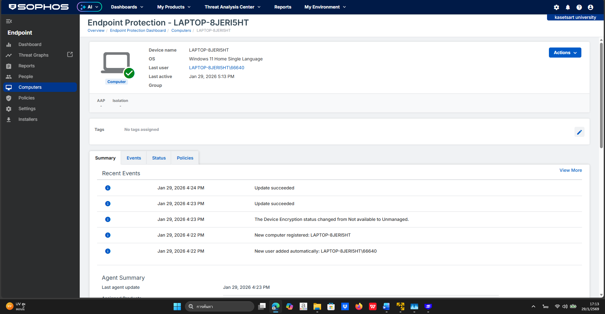
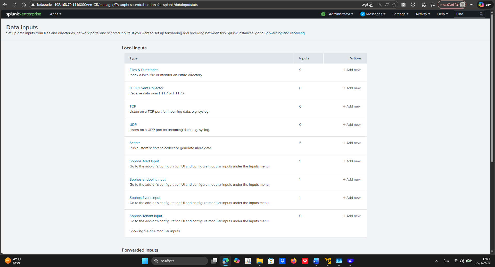
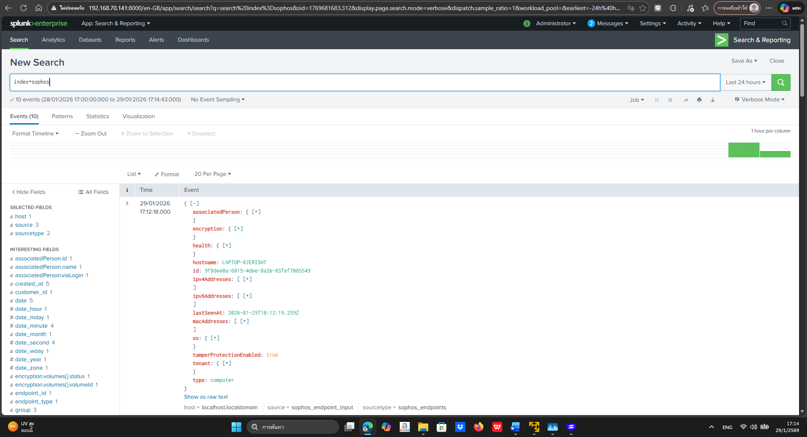

# Endpoint Detection & Response (EDR) – Hands-on Lab

เอกสารฉบับนี้จัดทำขึ้นเพื่อแสดงการทดลองใช้งาน
Endpoint Detection & Response (EDR)
โดยใช้ Sophos Endpoint Protection
ร่วมกับระบบ SIEM (Splunk)

การทดลองนี้มีวัตถุประสงค์เพื่อเรียนรู้กระบวนการ
ติดตั้ง EDR, onboard endpoint และส่ง log ไปยัง SIEM
โดยไม่ทำการรัน malware หรือ ransomware จริง

---

## 🎯 วัตถุประสงค์ของการทดลอง

- เรียนรู้การติดตั้งและใช้งาน Sophos EDR
- ทดสอบการเชื่อมต่อและส่ง log จาก endpoint ไปยัง Splunk
- สร้างความเข้าใจใน EDR-to-SIEM pipeline
- เตรียมความพร้อมสำหรับการทำ Detection และ Incident Response ในอนาคต

---

## 🛠️ เครื่องมือที่ใช้

- Sophos Endpoint Protection / EDR
- Splunk (Log Management & SIEM)
- Windows Endpoint (เครื่องทดสอบส่วนตัว)

---

## 🧪 ขั้นตอนการทดลอง (Lab Activities)

### 1️⃣ การติดตั้ง Sophos Agent บน Endpoint

- ทำการติดตั้ง Sophos Agent บนเครื่อง endpoint
- ตรวจสอบสถานะการเชื่อมต่อกับ Sophos Central
- Endpoint แสดงสถานะ Protected และ Healthy

(ดูภาพประกอบด้านล่าง)

---

### 2️⃣ การเชื่อมต่อ Sophos กับ Splunk

- ตั้งค่าให้ Sophos ส่ง log ไปยัง Splunk
- ตรวจสอบการรับ log จาก Sophos ใน Splunk
- Log ที่ได้รับประกอบด้วย:
  - Endpoint events
  - Policy events
  - Process-related logs

---

### 3️⃣ การตรวจสอบ Log ใน Splunk

- ยืนยันว่า Splunk สามารถรับและแสดง Sophos logs ได้
- ใช้ log เป็นพื้นฐานสำหรับ:
  - Monitoring
  - Detection
  - Incident Investigation ในอนาคต

---

## 🧠 สิ่งที่ได้เรียนรู้ (Lessons Learned)

- เข้าใจการทำงานของ EDR ในระดับ endpoint
- เห็นภาพการไหลของข้อมูลจาก EDR ไปยัง SIEM
- ตระหนักถึงความสำคัญของ log visibility
- สามารถนำระบบนี้ไปต่อยอดเป็น:
  - Detection rule
  - Alerting
  - Incident response playbook

---

## 🚀 แนวทางการต่อยอดในอนาคต

- สร้าง detection rule จาก Sophos logs ใน Splunk
- ทดลอง response action เช่น isolate endpoint (ใน lab)
- ผสาน EDR logs กับ use case ด้าน malware / ransomware
- ใช้เป็นพื้นฐานสำหรับ Blue Team และ SOC workflow

---

## 📝 หมายเหตุ

การทดลองนี้เป็นการเรียนรู้เชิงระบบและกระบวนการ
ไม่ได้มีการรัน ransomware หรือ malware จริง
เพื่อหลีกเลี่ยงความเสี่ยงต่อเครื่องทดสอบ

